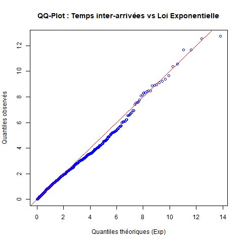
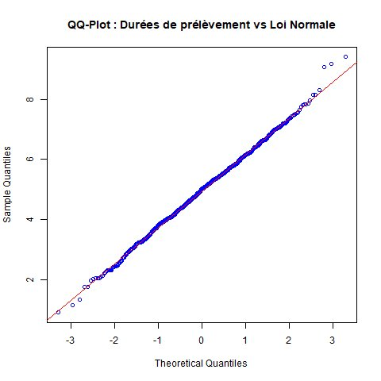
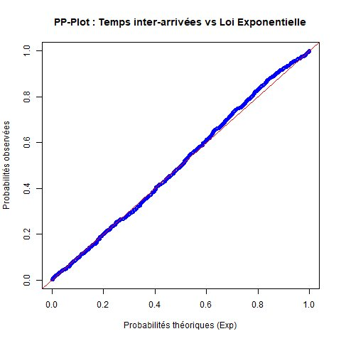
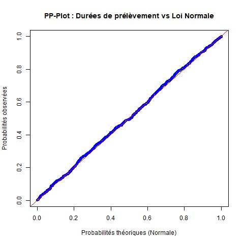

# Simulation de Monte-Carlo — File d'attente en laboratoire

Projet réalisé de manière personnel, sujet realisé par une IA.

## Contexte

Un laboratoire d'analyses médicales reçoit des patients pour des prises de sang. On modélise les temps inter-arrivées par une **loi Exponentielle** (λ = 0.5) et les durées de prélèvement par une **loi Normale** (μ = 5 min, σ = 1.2 min).

L'objectif est de simuler ces variables aléatoires et de **vérifier l'adéquation** entre les données simulées et les lois théoriques via des QQ-Plots et PP-Plots.

## Résultats

### QQ-Plots

| Temps inter-arrivées vs Exponentielle | Durées de prélèvement vs Normale |
|:---:|:---:|
|  |  |

Les points s'alignent bien sur la diagonale. On observe un léger décrochage dans la queue droite du QQ-Plot exponentiel, ce qui est classique : les valeurs extrêmes sont plus dispersées.

### PP-Plots

| Temps inter-arrivées vs Exponentielle | Durées de prélèvement vs Normale |
|:---:|:---:|
|  |  |

Les PP-Plots confirment l'ajustement. On remarque qu'ils sont moins sensibles aux écarts dans les queues de distribution que les QQ-Plots.

## Lancer le script

```r
source("simulation_montecarlo.R")
```

Les 4 graphiques sont exportés dans le dossier `graphiques/`.

## Outils

- R / RStudio
- Fonctions : `rexp()`, `rnorm()`, `qexp()`, `pexp()`, `pnorm()`, `qqnorm()`, `qqline()`
